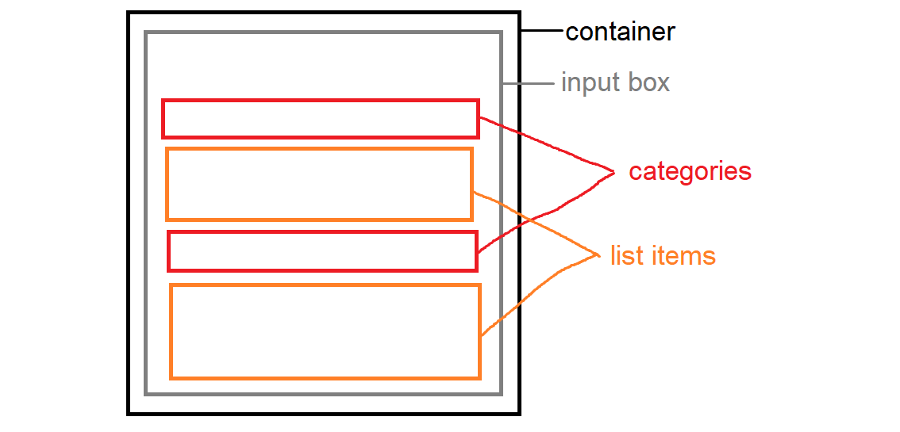

# Todo List

## Description

This project was bootstrapped with [Create React App](https://github.com/facebook/create-react-app).

Created a basic Todo list using react to begin learning the framework.

You can add to the "**Todo**" list and mark each item as "**Done**". You can also clear all of the "**Done**" items

## Preview

Here is a preview of my Todo List

## Planning

I broke down the UI into a component hierarchy to better understand and visualise the flow of props between the components

## Available Scripts

In the project directory, you can run:

### `npm start`

Runs the app in the development mode.\
Open [http://localhost:3000](http://localhost:3000) to view it in your browser.

The page will reload when you make changes.\
You may also see any lint errors in the console.
